# DaoMix Frontend: Cross-Chain Mixing Demo

## Overview

The DaoMix frontend demonstrates how **DaoChain serves as a shared privacy service** for the entire Polkadot ecosystem. This enhanced dApp shows:

- **Transport Layer**: Multi-hop onion routing through mix nodes
- **Cross-Chain Mixing**: How other parachains can use DaoChain via XCM
- **MixJob Integration**: Real-time job submission and status tracking

## Architecture

```mermaid
graph TD
    A[Other Parachains] -->|XCM Transact| B[DaoChain MixJob Pallet]
    B --> C[Onion Encryption]
    C --> D[Multi-Hop Mixing]
    D --> E[Blockchain Verification]
    E -->|XCM Response| A

    F[Frontend dApp] -->|JSON-RPC| G[MixNode Proxy]
    G -->|Onion Route| H[Entry Node → Middle → Exit]
    H --> I[Polkadot RPC]
```



## Current Implementation

### Basic Structure

```tsx
// app/page.tsx - Main demo page
'use client';

import { useEffect, useState } from 'react';
import { DotMixProvider } from '@polokol/dotmix-provider';

export default function Home() {
  // Transport layer state
  const [status, setStatus] = useState<'idle' | 'loading' | 'ok' | 'error'>('idle');
  const [latestBlockLabel, setLatestBlockLabel] = useState<string>('');

  // Cross-chain mixing state
  const [daochainStatus, setDaochainStatus] = useState<'idle' | 'loading' | 'ok' | 'error'>('idle');
  const [crossChainExample, setCrossChainExample] = useState<string>('');
  const [mixJobInfo, setMixJobInfo] = useState<string>('');
}
```

## Enhanced Features

### 1. Transport Layer Demo

Demonstrates multi-hop onion routing through the mixnet:

```tsx
const DEFAULT_MIXNODE_URL = 'http://127.0.0.1:9000/rpc';

const fetchBlock = async () => {
  setStatus('loading');
  try {
    const provider = new DotMixProvider({
      mixnodeUrl: DEFAULT_MIXNODE_URL,
    });

    const result = await provider.request('chain_getBlock', []);

    // Extract and display block number
    if (result?.block?.header?.number) {
      const blockNum = typeof result.block.header.number === 'string'
        ? parseInt(result.block.header.number.replace(/^0x/, ''), 16)
        : result.block.header.number;
      setLatestBlockLabel(`#${blockNum.toLocaleString()}`);
    }

    setStatus('ok');
  } catch (error) {
    setStatus('error');
  }
};
```

### 2. Cross-Chain Mixing Demo

Shows how other parachains can submit mixing jobs to DaoChain:

```tsx
const demonstrateCrossChainMixing = async () => {
  setDaochainStatus('loading');
  try {
    // Simulate XCM message from another parachain
    const mockCrossChainRequest = {
      parachainId: 2001, // Example: Asset Hub
      electionId: 42,
      jobDescription: "Privacy-preserving vote mixing for governance election"
    };

    // Create XCM message representation
    const xcmMessage = {
      origin: `Parachain ${mockCrossChainRequest.parachainId}`,
      destination: "DaoChain (Parachain 2000)",
      call: `mixJob.submitJob(${mockCrossChainRequest.electionId})`,
      purpose: mockCrossChainRequest.jobDescription
    };

    setCrossChainExample(JSON.stringify(xcmMessage, null, 2));

    // Simulate MixJob creation response
    const mockJobResponse = {
      jobId: Math.floor(Math.random() * 100000),
      status: "Pending",
      requester: `Parachain ${mockCrossChainRequest.parachainId}`,
      electionId: mockCrossChainRequest.electionId,
      createdAt: new Date().toISOString()
    };

    setMixJobInfo(JSON.stringify(mockJobResponse, null, 2));
    setDaochainStatus('ok');

  } catch (error) {
    setDaochainStatus('error');
  }
};
```

### 3. UI Components

#### Transport Layer Section

```tsx
<section style={{
  marginTop: '2rem',
  padding: '1.5rem',
  backgroundColor: '#f9f9f9',
  borderRadius: '8px',
  border: '1px solid #e0e0e0'
}}>
  <h2>🔗 Transport Layer: Multi-Hop Onion Routing</h2>

  <p>
    <strong>Status:</strong>{' '}
    <span style={{
      color: status === 'ok' ? '#22c55e' : status === 'error' ? '#ef4444' : '#6b7280',
      fontWeight: 'bold'
    }}>
      {status === 'ok' ? 'Connected via Onion Mix' : status}
    </span>
  </p>

  <p>
    <strong>Onion Route:</strong>{' '}
    <code>Client → Entry Node → Middle Node → Exit Node → Polkadot RPC</code>
  </p>

  {latestBlockLabel && (
    <p>
      <strong>Latest Polkadot Block:</strong>{' '}
      <span style={{ fontFamily: 'monospace', color: '#3b82f6', fontWeight: '600' }}>
        {latestBlockLabel}
      </span>
    </p>
  )}
</section>
```

#### Cross-Chain Mixing Section

```tsx
<section style={{
  marginTop: '2rem',
  padding: '1.5rem',
  backgroundColor: '#e8f4fd',
  borderRadius: '8px',
  border: '1px solid #90cdf4'
}}>
  <h2>🌐 Cross-Chain Mixing Service</h2>

  <p>
    DaoChain acts as a <strong>shared mixing service</strong> for the entire Polkadot ecosystem.
    Other parachains can submit privacy jobs via XCM without implementing their own mixnet.
  </p>

  <div style={{ marginTop: '1rem', display: 'flex', gap: '1rem', alignItems: 'center' }}>
    <button
      onClick={demonstrateCrossChainMixing}
      disabled={daochainStatus === 'loading'}
      style={{
        padding: '0.75rem 1.5rem',
        backgroundColor: daochainStatus === 'loading' ? '#cbd5e0' : '#3182ce',
        color: 'white',
        border: 'none',
        borderRadius: '6px',
        cursor: daochainStatus === 'loading' ? 'not-allowed' : 'pointer'
      }}
    >
      {daochainStatus === 'loading' ? 'Submitting XCM...' : '🚀 Submit Cross-Chain Mix Job'}
    </button>

    <div style={{
      padding: '0.5rem 1rem',
      backgroundColor: daochainStatus === 'ok' ? '#c6f6d5' : '#f7fafc',
      borderRadius: '4px'
    }}>
      DaoChain Status: <strong>
        {daochainStatus === 'ok' ? 'Job Accepted' : 'Ready'}
      </strong>
    </div>
  </div>

  {/* XCM Message Display */}
  {crossChainExample && (
    <div style={{ marginTop: '1.5rem' }}>
      <h3>📨 XCM Message Sent:</h3>
      <pre style={{
        padding: '1rem',
        backgroundColor: '#2d3748',
        color: '#e2e8f0',
        borderRadius: '6px',
        overflow: 'auto'
      }}>
        {crossChainExample}
      </pre>
    </div>
  )}

  {/* MixJob Response Display */}
  {mixJobInfo && (
    <div style={{ marginTop: '1.5rem' }}>
      <h3>✅ MixJob Created on DaoChain:</h3>
      <pre style={{
        padding: '1rem',
        backgroundColor: '#c6f6d5',
        color: '#22543d',
        borderRadius: '6px'
      }}>
        {mixJobInfo}
      </pre>
    </div>
  )}
</section>
```

#### Architecture Overview Section

```tsx
<section style={{
  marginTop: '2rem',
  padding: '1.5rem',
  backgroundColor: '#fef5e7',
  borderRadius: '8px',
  border: '1px solid #f6ad55'
}}>
  <h2>🏗️ Cross-Chain Architecture</h2>

  <div style={{
    display: 'grid',
    gridTemplateColumns: '1fr 1fr',
    gap: '2rem',
    marginTop: '1rem'
  }}>
    <div>
      <h3>Other Parachains</h3>
      <ul>
        <li>Asset Hub (Parachain 1000)</li>
        <li>Collectives (Parachain 1001)</li>
        <li>Bridge Hub (Parachain 1002)</li>
        <li>Your Custom Parachain</li>
      </ul>
    </div>

    <div>
      <h3>DaoChain Services</h3>
      <ul>
        <li>🧅 Onion Encryption</li>
        <li>🔀 Multi-Hop Mixing</li>
        <li>📦 Sharding & Bundling</li>
        <li>🔐 PQ Cryptography</li>
        <li>⛓️ Blockchain Verification</li>
      </ul>
    </div>
  </div>

  <div style={{
    marginTop: '1.5rem',
    padding: '1rem',
    backgroundColor: 'white',
    borderRadius: '6px',
    border: '1px solid #e2e8f0'
  }}>
    <h4>XCM Flow:</h4>
    <code style={{
      display: 'block',
      fontFamily: 'monospace',
      lineHeight: '1.4'
    }}>
      Other Parachain → XCM Transact → DaoChain.mixJob.submitJob()<br/>
      &nbsp;&nbsp;&nbsp;&nbsp;&nbsp;&nbsp;&nbsp;&nbsp;&nbsp;&nbsp;&nbsp;&nbsp;&nbsp;&nbsp;&nbsp;&nbsp;&nbsp;&nbsp;&nbsp;&nbsp;↓<br/>
      DaoChain Processes → Mixes Votes → Returns Results via XCM
    </code>
  </div>
</section>
```

## Integration Steps

### 1. Update Dependencies

```json
// dapp/package.json
{
  "dependencies": {
    "@polokol/dotmix-provider": "file:../sdk",
    "next": "^14.0.4",
    "react": "^18.2.0",
    "react-dom": "^18.2.0"
  }
}
```

### 2. Environment Configuration

```bash
# .env.local
NEXT_PUBLIC_MIXNODE_URL=http://127.0.0.1:9000/rpc
NEXT_PUBLIC_DAOCHAIN_WS_URL=ws://127.0.0.1:9944
```

### 3. Type Definitions

```tsx
// types/cross-chain.ts
export interface CrossChainMixJob {
  parachainId: number;
  electionId: number;
  description: string;
}

export interface MixJobResponse {
  jobId: number;
  status: 'Pending' | 'Running' | 'Completed' | 'Failed';
  requester: string;
  electionId: number;
  createdAt: string;
}

export type DemoStatus = 'idle' | 'loading' | 'ok' | 'error';
```

### 4. Custom Hooks

```tsx
// hooks/useCrossChainDemo.ts
import { useState } from 'react';
import { CrossChainMixJob, MixJobResponse, DemoStatus } from '../types/cross-chain';

export function useCrossChainDemo() {
  const [status, setStatus] = useState<DemoStatus>('idle');
  const [xcmMessage, setXcmMessage] = useState<string>('');
  const [mixJobResponse, setMixJobResponse] = useState<string>('');

  const submitMixJob = async (job: CrossChainMixJob): Promise<void> => {
    setStatus('loading');
    try {
      // Simulate XCM submission
      const xcmPayload = {
        origin: `Parachain ${job.parachainId}`,
        destination: "DaoChain (Parachain 2000)",
        call: `mixJob.submitJob(${job.electionId})`,
        purpose: job.description
      };

      setXcmMessage(JSON.stringify(xcmPayload, null, 2));

      // Simulate DaoChain response
      const response: MixJobResponse = {
        jobId: Math.floor(Math.random() * 100000),
        status: 'Pending',
        requester: `Parachain ${job.parachainId}`,
        electionId: job.electionId,
        createdAt: new Date().toISOString()
      };

      setMixJobResponse(JSON.stringify(response, null, 2));
      setStatus('ok');
    } catch (error) {
      setStatus('error');
    }
  };

  return {
    status,
    xcmMessage,
    mixJobResponse,
    submitMixJob
  };
}
```

## Testing

### Unit Tests

```tsx
// __tests__/CrossChainDemo.test.tsx
import { render, screen, fireEvent, waitFor } from '@testing-library/react';
import CrossChainDemo from '../components/CrossChainDemo';

describe('Cross-Chain Demo', () => {
  it('submits mix job successfully', async () => {
    render(<CrossChainDemo />);

    const submitButton = screen.getByText('🚀 Submit Cross-Chain Mix Job');
    fireEvent.click(submitButton);

    await waitFor(() => {
      expect(screen.getByText('Job Accepted')).toBeInTheDocument();
    });

    expect(screen.getByText('📨 XCM Message Sent:')).toBeInTheDocument();
    expect(screen.getByText('✅ MixJob Created on DaoChain:')).toBeInTheDocument();
  });
});
```

### E2E Tests

```tsx
// e2e/cross-chain-demo.spec.ts
import { test, expect } from '@playwright/test';

test('cross-chain mixing demo works end-to-end', async ({ page }) => {
  await page.goto('http://localhost:3000');

  // Check transport layer connection
  await expect(page.locator('text=Connected via Onion Mix')).toBeVisible();

  // Submit cross-chain mix job
  await page.click('text=🚀 Submit Cross-Chain Mix Job');

  // Verify XCM message appears
  await expect(page.locator('text=📨 XCM Message Sent:')).toBeVisible();

  // Verify MixJob response appears
  await expect(page.locator('text=✅ MixJob Created on DaoChain:')).toBeVisible();

  // Check status updates
  await expect(page.locator('text=Job Accepted')).toBeVisible();
});
```

## Deployment

### Development

```bash
# Start DaoChain
cd polkadot-sdk
./target/release/parachain-template-node --chain ./chain_spec.json --dev --rpc-external --ws-external

# Start mix nodes
cd mixer
npm run dev:mixnode                    # Port 9000
MIX_NODE_PORT=9001 npm run dev:mixnode # Port 9001
MIX_NODE_PORT=9002 npm run dev:mixnode # Port 9002

# Start frontend
cd dapp
npm run dev
```

### Production Build

```bash
cd dapp
npm run build
npm start
```

## Performance Considerations

### Optimization Strategies

1. **Lazy Loading**: Load cross-chain components only when needed
2. **Memoization**: Cache XCM message formatting
3. **WebSocket Management**: Proper connection handling for DaoChain
4. **Error Boundaries**: Graceful degradation when services are unavailable

### Monitoring

```tsx
// hooks/usePerformanceMonitor.ts
export function usePerformanceMonitor() {
  const [metrics, setMetrics] = useState({
    xcmSubmissionTime: 0,
    mixJobResponseTime: 0,
    transportLatency: 0
  });

  const trackXcmSubmission = (startTime: number) => {
    const endTime = Date.now();
    setMetrics(prev => ({
      ...prev,
      xcmSubmissionTime: endTime - startTime
    }));
  };

  return { metrics, trackXcmSubmission };
}
```

## Security Considerations

### Frontend Security

1. **Input Validation**: Validate all user inputs before XCM simulation
2. **CORS Configuration**: Ensure proper CORS setup for mixnode communication
3. **Error Handling**: Never expose internal errors to users
4. **Rate Limiting**: Implement client-side rate limiting for demo actions

### Privacy Protection

1. **No Real Data**: Demo uses mock data only
2. **Clear Disclaimers**: Indicate when features are simulated
3. **Educational Focus**: Emphasize privacy concepts without compromising security

## Future Enhancements

### Real XCM Integration

```tsx
// Real implementation with Polkadot.js
import { ApiPromise, WsProvider } from '@polkadot/api';

const submitRealXcmJob = async (job: CrossChainMixJob) => {
  const api = await ApiPromise.create({
    provider: new WsProvider('ws://localhost:9944')
  });

  // Send actual XCM transact to DaoChain
  const extrinsic = api.tx.mixJob.submitJob(job.electionId);

  // Submit via XCM to DaoChain
  // Implementation would use actual XCM protocols
};
```

### Advanced UI Features

- **Real-time Job Status**: WebSocket updates from DaoChain
- **Multi-Parachain Selection**: Dropdown to choose source parachain
- **Job History**: Display previous mixing jobs
- **Performance Metrics**: Show mixing times and success rates

This enhanced frontend demonstrates DaoChain's role as Polkadot's privacy infrastructure, enabling any parachain to access enterprise-grade mixing services through simple XCM calls.

